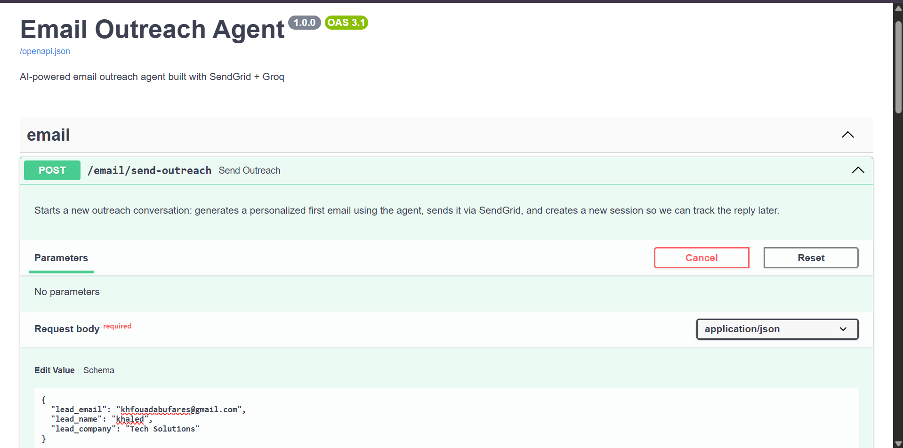
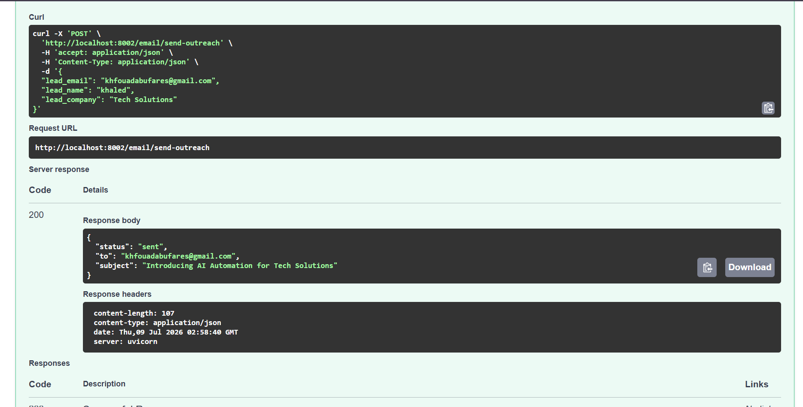
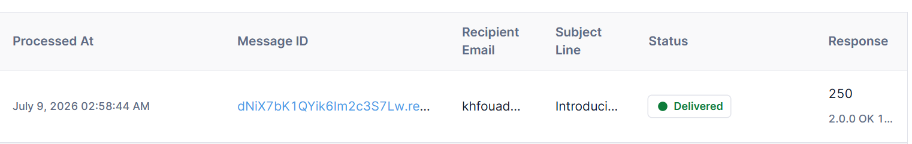
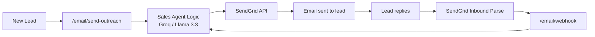

# AI Email Outreach Agent

> An AI-powered email agent that sends personalized outreach emails to potential leads and automatically replies when they respond — no human agent required.

[](https://python.org)
[](https://fastapi.tiangolo.com)
[](https://sendgrid.com)
[](https://groq.com)
[](https://www.docker.com)
[](LICENSE)

Part of the **AI Business Automation Suite** — Phase 3 of 4.

---

## Preview

**1. Sending a personalized outreach email:**



**2. AI-generated response — Groq wrote a personalized subject and body:**



**3. Confirmed delivery in SendGrid's Activity Log:**



---

## What Is This?

This project sends and manages sales outreach emails with an AI agent that:
- Writes personalized, context-aware cold outreach emails to new leads
- Understands and replies to incoming responses (Arabic or English)
- Keeps the conversation coherent across multiple email exchanges
- Runs fully in **mock mode** with zero API keys — so anyone can try it in under a minute

> **Mock Mode by default** — no real API keys needed to explore the code and logic. Add real keys to `.env` and it automatically switches to production mode.

---

## Features

- **Automated outreach emails** — personalized subject + body generated per lead
- **Context-aware replies** powered by Groq (Llama 3.3 70B) — free tier, no OpenAI cost
- **Automatic language matching** — replies in Arabic or English based on the lead's message
- **Per-lead conversation memory** — remembers context across the email thread
- **Mock mode** — full functionality testable with zero API keys or cost
- **Dockerized** — one command to run
- **Automated tests** — Pytest suite covering all endpoints

---

## How It Works



**Data flow:**
1. A new lead's info (`email`, `name`, `company`) is sent to `/email/send-outreach`
2. `SalesAgent` generates a personalized subject + body using Groq (Llama 3.3)
3. The email is sent via SendGrid, and a session is created for that lead
4. If the lead replies, SendGrid's Inbound Parse forwards it to `/email/webhook`
5. `SalesAgent` looks up the existing session and generates a context-aware reply
6. The reply is sent back via SendGrid, continuing the thread

---

## Why This Matters (Industry Data)

AI outreach agents aren't a novelty — they're becoming standard infrastructure for sales teams:

- **Cost per interaction:** a human-handled outreach email costs **$6-12** on average in rep time, versus **$0.30-0.50** for an AI-handled one — a 90-95% reduction ([source](https://www.raftlabs.com/blog/voice-ai-statistics))
- **Projected savings:** Gartner forecasts conversational AI will cut global sales/support labor costs by **$80 billion by 2026**
- **Availability:** AI agents draft and respond to outreach 24/7, with no delay between a lead's reply and a follow-up
- **ROI timeline:** most deployments show measurable ROI within **3-6 months** (Forrester Consulting)

*These figures reflect industry-wide trends, not results specific to this project — shared here for context on why this type of automation is in demand.*

---

## Project Structure

```
email-outreach-agent/
├── app/
│   ├── main.py                # Application entry point
│   ├── config.py               # Settings and API keys
│   ├── routes/
│   │   └── email.py            # Outreach + webhook endpoints
│   └── services/
│       ├── sales_agent.py      # Email generation + reply logic (mock + real via Groq)
│       └── email_sender.py     # SendGrid integration
├── tests/
│   └── test_main.py
├── Dockerfile
├── docker-compose.yml
├── requirements.txt
├── .env.example
└── README.md
```

---

## Tech Stack

| Layer | Technology |
|---|---|
| Backend Framework | FastAPI (Python) |
| Email delivery | SendGrid API |
| Conversation logic | Groq (Llama 3.3 70B) — free tier |
| Session storage | In-memory (keyed by lead's email address) |
| Containerization | Docker + Docker Compose |
| Testing | Pytest |

---

## Setup & Run

### 1. Clone the repository

```bash
git clone https://github.com/Khaled-fouad0/email-outreach-agent.git
cd email-outreach-agent
```

### 2. Configure environment

```bash
cp .env.example .env
```

Leave all values empty to run in **mock mode** (no cost, no keys needed), or fill in:
- `GROQ_API_KEY` — free at [console.groq.com/keys](https://console.groq.com/keys)
- `SENDGRID_API_KEY` / `SENDER_EMAIL` — from [sendgrid.com](https://sendgrid.com) (sender email must match a verified Sender Identity)

### 3. Run it

**Option A — Docker (recommended):**
```bash
docker-compose up --build
```

**Option B — Directly (no Docker):**
```bash
python -m venv venv
source venv/bin/activate   # Windows: venv\Scripts\activate
pip install -r requirements.txt
uvicorn app.main:app --reload --port 8002
```

API available at `http://localhost:8002`
Interactive docs at `http://localhost:8002/docs`

---

## API Reference

| Method | Endpoint | Description |
|--------|----------|-------------|
| `GET` | `/` | Health/status check, shows current mode (mock/production) |
| `GET` | `/health` | Simple liveness check for Docker/hosting platforms |
| `POST` | `/email/send-outreach` | Sends a personalized first email to a new lead |
| `POST` | `/email/webhook` | SendGrid Inbound Parse webhook — triggered when a lead replies |

**Example — send an outreach email:**
```bash
curl -X POST http://localhost:8002/email/send-outreach \
  -H "Content-Type: application/json" \
  -d '{"lead_email": "lead@example.com", "lead_name": "Ahmed", "lead_company": "ABC Corp"}'
```

**Example — simulate a lead's reply:**
```bash
curl -X POST http://localhost:8002/email/webhook \
  --data-urlencode "from=lead@example.com" \
  --data-urlencode "subject=Re: Quick question" \
  --data-urlencode "text=عايز اعرف السعر"
```

---

## Tested & Verified

This project has been tested against the real SendGrid API, not just simulated requests:
-  Outreach emails are generated with personalized, relevant subject lines and bodies
- SendGrid confirms delivery (`Delivered` status in Activity Log)
- The webhook correctly processes incoming replies and generates context-aware responses
- Conversation memory persists correctly across the email thread

> **Known limitation:** emails sent via SendGrid's default (non-authenticated) sending domain can be silently filtered by some mail providers (e.g. Gmail) even after being marked "Delivered" at the SMTP level. This is a common limitation of new SendGrid accounts without full domain authentication (DNS-based), not a bug in this codebase. Production use would require setting up SendGrid Domain Authentication.

---

## Running Tests

```bash
pytest tests/ -v
```

---

## Notes

- Session storage (`active_sessions`) is in-memory — restarting the server clears all active conversations. Use Redis for multi-instance production deployments.
- `SENDER_EMAIL` must exactly match a verified Sender Identity in your SendGrid account, or sending will fail.
- To receive real replies automatically, SendGrid's **Inbound Parse** must be configured to forward incoming emails to `/email/webhook` (requires a public URL, e.g. via ngrok in development).

---

## Possible Extensions

- [ ] SendGrid Domain Authentication for reliable inbox delivery
- [ ] Redis-backed session storage for multi-instance deployments
- [ ] Email open/click tracking and analytics
- [ ] CRM integration (auto-log leads and conversation history)
- [ ] Multi-lead batch outreach campaigns
- [ ] A/B testing for subject lines

---

## Roadmap (AI Business Automation Suite)

- [x] **Phase 1:** Voice Sales Agent
- [x] **Phase 2:** WhatsApp Sales Agent
- [x] **Phase 3:** Email Outreach Agent ← *we are here*
- [x] **Phase 4:** Appointment Booking Agent
- [ ] **Phase 5:** Unified platform combining all agents

---

## Author

Built by **Khaled** 🤙🏽

[](https://github.com/Khaled-fouad0)

---

## License

MIT — free to use, modify, and distribute.
